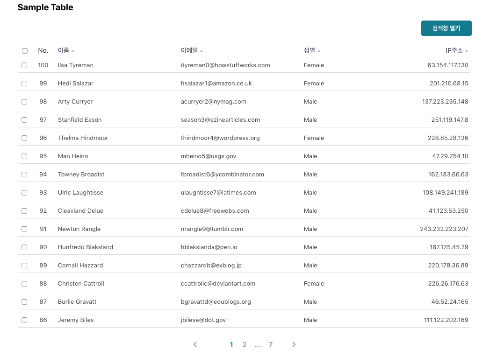

## react-minimal-table
- lodash
- styled-components

```html
<Table
  data={sampleData}
  index
  perPage={15}
  checkbox
  headers={[
    {
      title: "이름",
      value: "first_name",
      render: item => `${item.first_name} ${item.last_name}`
    },
    { title: "이메일", value: "email" },
    { title: "성별", value: "gender", width: 90 },
    { title: "IP주소", value: "ip_address", align: "right" }
  ]}
/>
```


